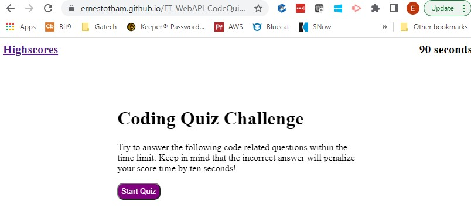
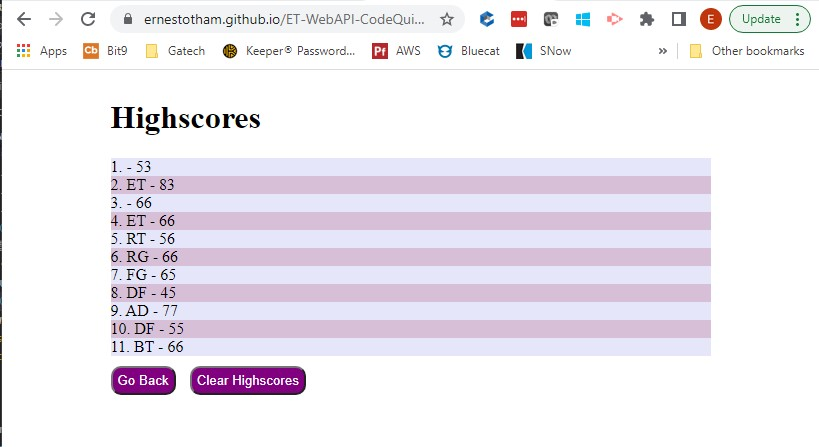

# ET-WebAPI-CodeQuiz

this is a sample timed quiz on javascript

Criteria:
    once the quiz start there is a 1 min count down
    if the answer is incorrect the time is reduced by 10s
    if time reaches 0 or all questions are answer then the app will record grade

**Here is the link: https://ernestotham.github.io/ET-WebAPI-CodeQuiz/

## Mock-Up

The following image shows the web application's appearance and functionality:

# ET-WebAPI-CodeQuiz

